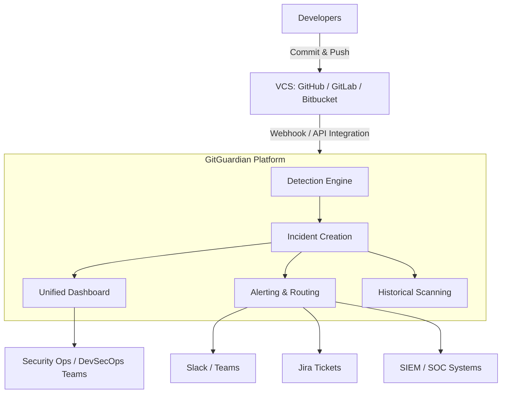
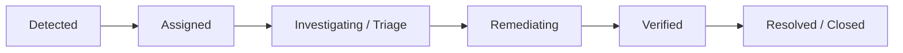
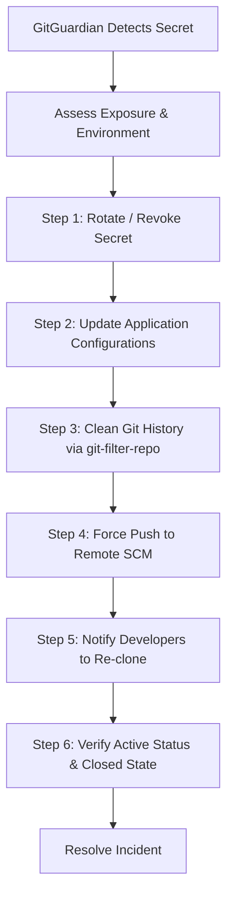
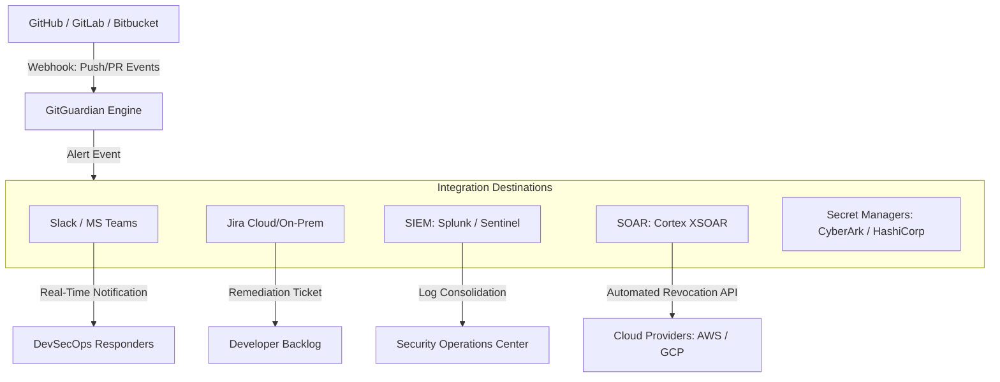
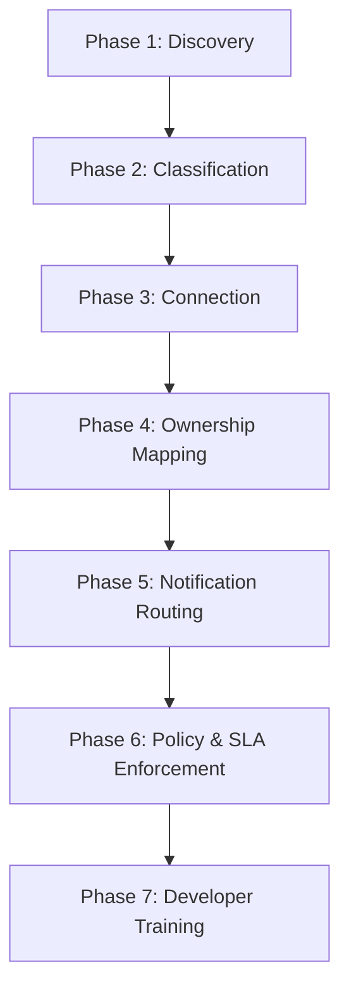
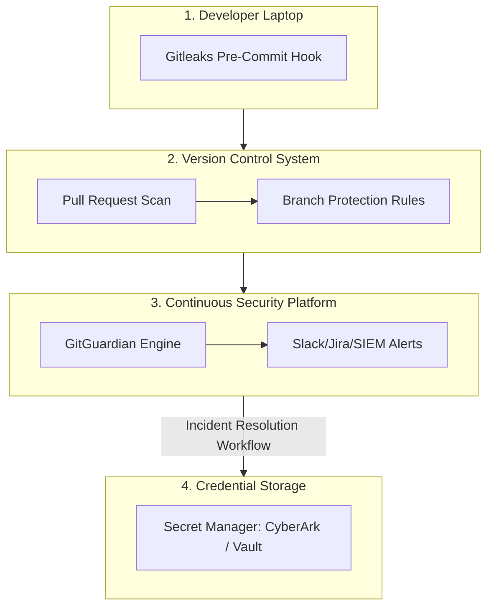

# Table of Contents

- [Objective](#objective)
- [Module 1: Fundamentals of GitGuardian](#module-1-fundamentals-of-gitguardian)
  - [What is GitGuardian?](#what-is-gitguardian)
  - [Gitleaks vs. GitGuardian](#gitleaks-vs-gitguardian)
  - [Why Enterprises Need GitGuardian](#why-enterprises-need-gitguardian)
  - [GitGuardian Architecture](#gitguardian-architecture)
  - [Core Components](#core-components)
  - [Key Security Metrics](#key-security-metrics)
  - [Enterprise Deployment Model](#enterprise-deployment-model)
- [Module 2: Incident Management](#module-2-incident-management)
  - [What is an Incident?](#what-is-an-incident)
  - [Incident Lifecycle](#incident-lifecycle)
  - [Lifecycle Steps](#lifecycle-steps)
  - [Incident Statuses & False Positives](#incident-statuses--false-positives)
  - [Audit Trail & Compliance](#audit-trail--compliance)
  - [Security Mindset Shift](#security-mindset-shift)
- [Module 3: Secret Remediation](#module-3-secret-remediation)
  - [What is Secret Remediation?](#what-is-secret-remediation)
  - [Core Security Principles](#core-security-principles)
  - [Remediation Workflow](#remediation-workflow)
  - [Remediation Playbook](#remediation-playbook)
  - [Common Remediation Mistakes](#common-remediation-mistakes)
  - [SOAR & Automation Possibilities](#soar--automation-possibilities)
- [Module 4: Enterprise Integrations](#module-4-enterprise-integrations)
  - [Why Integrations Exist](#why-integrations-exist)
  - [Enterprise Integration Architecture](#enterprise-integration-architecture)
  - [Supported Enterprise Integrations](#supported-enterprise-integrations)
  - [Integration Summary](#integration-summary)
- [Module 5: Enterprise Rollout Strategy](#module-5-enterprise-rollout-strategy)
  - [The Big Picture](#the-big-picture)
  - [Teams & Responsibilities](#teams--responsibilities)
  - [Rollout Phases](#rollout-phases)
  - [Repository Classification & SLAs](#repository-classification--slas)
  - [Enterprise KPIs](#enterprise-kpis)
  - [Exception & Governance Process](#exception--governance-process)
  - [Defense-in-Depth Architecture](#defense-in-depth-architecture)
  - [Enterprise Security Maturity Model](#enterprise-security-maturity-model)
  - [Enterprise Deployment Case Study](#enterprise-deployment-case-study)
- [Module Interview Questions & Key Takeaways](#module-interview-questions--key-takeaways)
  - [Module 1 Q&A](#module-1-qa)
  - [Module 2 Q&A](#module-2-qa)
  - [Module 3 Q&A](#module-3-qa)
  - [Module 4 Q&A](#module-4-qa)
  - [Module 5 Q&A](#module-5-qa)

---

## Objective

Understand GitGuardian as an enterprise-grade Secrets Security Platform, contrast it with developer-focused utilities like Gitleaks, and master the configuration, remediation, and integration workflows required to secure source code management (SCM) environments at scale.

---

# Module 1: Fundamentals of GitGuardian

## What is GitGuardian?

GitGuardian is a centralized **Secrets Security Platform** designed for security operations, DevSecOps engineers, and enterprise organizations. It enables continuous protection against secret leaks by automating:

* **Detection:** Finding exposed secrets across full commit histories and active branches.
* **Risk Prioritization:** Categorizing exposed keys by severity, validity, and scope.
* **Investigation:** Assisting security teams in understanding exposure context.
* **Remediation:** Providing guided workflows to safely rotate and revoke credentials.
* **Continuous Monitoring:** Real-time scanning of all push events across SCM platforms.

---

## Gitleaks vs. GitGuardian

While both tools scan for secrets, they serve different operational scopes within an enterprise:

| Feature | Gitleaks | GitGuardian |
| :--- | :--- | :--- |
| **Primary Focus** | Local Developer Tool & CI/CD scanner | Enterprise Security & Incident Management Platform |
| **Operational Goal** | Immediate detection/blocking (Shift-Left) | Organization-wide visibility, remediation, and audit trail |
| **Workflow State** | Stateless (runs on demand, exits 0 or 1) | Stateful (tracks incidents, assigns owners, records status) |
| **Scope** | Single repository or branch | Thousands of repositories, organizations, and developers |
| **Remediation** | None (reports and exits) | Full incident management lifecycle with collaboration tools |

---

## Why Enterprises Need GitGuardian

In a large SCM environment, security cannot rely on developer vigilance alone. Consider a typical organization with:

* **500+ Developers** contributing daily.
* **200+ Repositories** under active development.
* **50+ Feature Teams** pushing code in parallel.
* **1,000+ Commits** generated daily.

Without centralized monitoring, security management cannot answer critical questions:
* *How many secrets leaked across our org this month?*
* *Which repositories/teams have the highest incident rate?*
* *Are incidents actively being resolved, and what is the average resolution time?*

GitGuardian consolidates SCM scan telemetry to provide a unified health dashboard and resolve these blind spots.

---

## GitGuardian Architecture



---

## Core Components

### 1. Detection Engine
Scans files and git metadata to detect sensitive keys. It looks for credentials such as AWS Access Keys, GCP Credentials, Azure Principal Secrets, GitHub PATs, Slack Webhooks, Database Connection Strings, SSH Keys, and OAuth Client Secrets.
* **Techniques Used:** Regex pattern matching, Shannon entropy analysis, surrounding code context, Machine Learning models, and live active validation (checking if the token is valid).

### 2. Incident Management System
Findings are not simply printed as output; they are registered as persistent security incidents.
* **Example Incident Details:**
  * **ID:** `#2458`
  * **Type:** AWS IAM User Access Key
  * **Repository:** `payment-service`
  * **Committer:** `j.doe@company.com`
  * **Status:** Open
  * **Severity:** Critical

### 3. Single Pane of Glass Dashboard
Consolidates SCM security metrics. Displays open incidents, severity breakdown, remediation status, affected repositories, and team risk profiles.

### 4. Real-Time Alerting
Distributes incident alerts to notification endpoints (Slack, Teams, Email) and logs them directly to ticketing systems (Jira) or SIEM log collectors.

### 5. Historical Scanning
Allows security teams to scan the entire historical commit trail of newly onboarded repositories to uncover legacy leaks.

### 6. Ownership & Accountability Mapping
Identifies the repository owner, business unit, and team membership based on SCM metadata, ensuring alerts are immediately routed to the correct responder.

---

## Key Security Metrics

* **Mean Time to Remediate (MTTR):** The average time elapsed between when a secret is committed to when it is successfully rotated and invalidated.
* **Incident Volume Trends:** Monthly comparisons (e.g., January: 40 leaks, February: 30, March: 15) to track whether developer education is driving down incident rates.
* **Risk Density Profile:** Identifying the top 5 riskiest repositories (e.g., `payment-service`, `customer-api`) that require architectural changes or pre-commit hook enforcement.

---

## Enterprise Deployment Model

An enterprise-wide secret prevention strategy relies on multiple defense layers working in tandem:

```text
[Developer Laptop]
 ├── Gitleaks Pre-Commit Hook (Prevents commits with secrets locally)
 └── Gitleaks Pre-Push Hook (Validates before outbound transfer)
        ↓
[GitHub / GitLab / Bitbucket]
 ├── Pull Request Pipeline Scan (Fails the build on PR stage)
 └── SCM Branch Protection Rules (Blocks merging of failed pipelines)
        ↓
[GitGuardian Security Platform]
 ├── Webhook-Driven Continuous Monitoring (Tracks all pushes instantly)
 ├── Automated Incident Routing (Slack, Jira, SIEM)
 └── Security Operations Dashboard (Governance, SLA Tracking, Auditing)
```

---

# Module 2: Incident Management

## What is an Incident?

An **Incident** in GitGuardian is a tracked event representing an exposed credential that requires remediation. Unlike raw scanning tools that report findings per line, GitGuardian groups identical leaked credentials within a repository into a single incident to streamline the response workflow.

---

## Incident Lifecycle



---

## Lifecycle Steps

### Step 1: Detection
An engineer pushes code containing a hardcoded API token. SCM webhooks trigger the GitGuardian engine. If a leak is found, a new incident is immediately opened, and alerts are dispatched.

### Step 2: Assignment
The platform routes the incident to the appropriate engineer or team based on repository ownership metadata.
* **Example:** `Assigned To: DevSecOps Engineer`

### Step 3: Investigation (Triage)
Security responders analyze the incident context by answering:
* *Is this a real secret or a mock value?* (True Positive vs. False Positive)
* *Is the secret currently active?* (Active validation status)
* *Which environment does it point to?* (Dev, QA, Staging, Production)
* *How long has it been exposed in SCM?*
* *Is the repository public or private?*

### Step 4: Prioritization
Responders assign severity based on the threat level:
* **Critical:** Production database passwords, AWS Root credentials, SSH Private Keys, production API keys. *SLA: Immediate remediation.*
* **High:** Staging/QA database credentials, GitHub PATs with write access. *SLA: Action within hours.*
* **Medium:** Development environment passwords, internal tokens, public testing API keys. *SLA: Action within days.*

### Step 5: Secret Rotation
The first active remediation step is always credential rotation (revoking the old key and generating a new one).

### Step 6: Git History Cleanup
Purging the secret from SCM history using specialized tools to ensure it cannot be recovered from past commits.

### Step 7: Verification
The security team confirms that the credentials have been invalidated, the code history is successfully cleaned, and SCM repositories no longer contain references to the leaked secret.

---

## Incident Statuses & False Positives

| Status | Meaning / Criteria |
| :--- | :--- |
| **Open** | Newly discovered incident; triage required. |
| **Assigned** | Ownership has been mapped to a responder or dev team. |
| **Investigating** | Context analysis, validation check, and risk assessment in progress. |
| **In Progress** | Credential rotation, application updates, or history cleanup underway. |
| **Verified** | Validation checks confirm the secret is now inactive and history is clean. |
| **Resolved** | Incident closed and archived. |
| **Ignored** | Marked as a false positive or an acceptable risk (e.g., test mocks). |

### Handling False Positives
If a developer commits a mock credential:
```properties
AWS_SECRET_ACCESS_KEY=YOUR_KEY_HERE
```
GitGuardian detects the key format but flags it. Responders investigate and transition the incident status to **Ignored (False Positive)** to filter it out of security metrics.

---

## Audit Trail & Compliance

To support compliance audits (SOC2, ISO27001, PCI-DSS, NIST), GitGuardian logs every action taken on an incident:
* Who triggered the leak (commit author).
* Who was assigned the incident.
* Actions taken during triage (active status checks).
* Timestamp of secret invalidation and history rewrite.
* Who closed the incident.

This structured audit trail serves as objective evidence that security operations actively monitors and remediates cryptographic secrets exposure.

---

## Security Mindset Shift

Transitioning from developer scanning utilities to GitGuardian introduces a system-level shift in how leaks are handled:

```text
Traditional Scanning (e.g., Gitleaks CLI):
  Secret Found ──> Output Logged ──> Developer Clears Local File (Remediation is manual & untracked)

Enterprise Incident Management (GitGuardian):
  Secret Found ──> Incident Logged ──> Ticket Created ──> Owner Assigned ──>
  Credential Rotated ──> History Rewritten ──> Status Verified ──> Audit Log Archived
```

---

# Module 3: Secret Remediation

## What is Secret Remediation?

Secret remediation is the end-to-end process of invalidating a leaked credential and restoring SCM state security. It requires coordination across development teams, security ops, and systems administrators.

> [!IMPORTANT]
> **Detection ≠ Remediation**
> Finding a secret or deleting it from the current line of code does not secure the system. The secret remains active in the cloud, and historical git commits still contain the key.

---

## Core Security Principles

1. **The Objective:** The primary goal is NOT to clean Git history. The primary goal is to **invalidate the secret everywhere it can be used**. Cleaning Git history is a secondary step to prevent future extraction.
2. **Order of Action:** Credential rotation must ALWAYS occur before git history cleanup. Rewriting history takes time and alerts attackers; immediately rotating the key cuts off their access immediately.

---

## Remediation Workflow



### Detailed Steps

#### Step 1: Assess Risk
Identify the credential type, permissions associated with the leaked token, the target environment (Production vs. Dev/QA), SCM repository visibility (Public vs. Private), and the duration of exposure.

#### Step 2: Rotate or Revoke
Immediately disable the leaked token at the source provider.
* **AWS:** Deactivate or delete the compromised Access Key ID.
* **GitHub:** Revoke the exposed Personal Access Token (PAT).
* **Databases:** Change the user password on the live server.

#### Step 3: Update Applications
Replace the old credential configurations in:
* Container configurations and Kubernetes Secrets.
* Environment variables inside hosting environments.
* CI/CD pipeline variables.
* *Best Practice:* Migrate the application to dynamically fetch credentials from a centralized Secret Manager (e.g., HashiCorp Vault, CyberArk, AWS Secrets Manager) instead of storing hardcoded keys in configurations.

#### Step 4: Clean Git History
Simply deleting a file and running a new commit does not secure history:
```bash
# WRONG REMEDIATION PATTERN
git rm secrets.env
git commit -m "Fix: removed secrets file"
git push
```
The secret is still extractable via `git log` or by cloning previous commit hashes. 

To clean SCM history, use specialized rewrite tools like `git-filter-repo` or BFG Repo Cleaner:
```bash
# Correct cleanup using git-filter-repo (purges secrets.env from all commits)
git filter-repo --path secrets.env --invert-paths
```
*Note:* Rewriting history changes commit hashes from the modification point forward.

#### Step 5: Force Push Changes
Push the rewritten history back to the SCM server:
```bash
git push origin --force-with-lease
```
Using `--force-with-lease` is safer than `--force` as it prevents overwriting upstream commits made by other developers during the cleanup process.

#### Step 6: Notify Developers
Broadcast history rewrites to the development team. All developers must pull the updated branch or re-clone the repository:
```bash
# Re-cloning ensures no local stale history branches push the secret back upstream
git clone <repository-url>
```

#### Step 7: Verification
The security responder verifies that:
* The credentials return an authentication failure when checked.
* SCM history scan tools confirm the target commits no longer contain the token.
* The GitGuardian dashboard marks the incident as **Verified & Resolved**.

---

## Remediation Playbook

Follow this operational checklist upon discovering an active AWS Access Key leak:

1. **Verify Leak:** GitGuardian active status checks verify the key is valid.
2. **Revoke Access:** Use AWS Console or CLI to immediately disable the access key.
3. **Generate Key:** Provision a new AWS access key pair.
4. **Deploy Secret:** Update AWS Secrets Manager or Vault with the new keys.
5. **Reload Apps:** Trigger deployments to fetch the rotated configuration.
6. **Rewrite Git:** Run `git-filter-repo` to purge the credential file from repository commits.
7. **Push Updates:** Run `git push origin --force-with-lease`.
8. **Dev Alert:** Inform team members to reset their local branches.
9. **Final Scan:** Trigger a GitGuardian re-scan to confirm the incident is cleared.
10. **Close Ticket:** Mark the GitGuardian incident and associated Jira ticket as Resolved.

---

## Common Remediation Mistakes

* **Mistake 1: Deleting the line of code/file only.** The secret is still in git history.
* **Mistake 2: Cleaning history before rotation.** Rewriting history takes time. During history rewriting, attackers can continue using the active token. Rotate the token first.
* **Mistake 3: Forgetting application updates.** Changing database passwords or API keys without deploying configuration updates will crash downstream production services.
* **Mistake 4: Developers keeping old clones.** A developer with a stale local clone might push a branch containing the old history, re-introducing the secret to SCM.
* **Mistake 5: Closing incidents prematurely.** Resolving the alert before confirming the token is disabled leads to open vulnerabilities.

---

## SOAR & Automation Possibilities

To reduce MTTR, mature DevSecOps organizations deploy **SOAR (Security Orchestration, Automation, and Response)** platforms.

```text
[GitGuardian Engine] ──> Webhook Triggered ──> [SOAR Platform (Cortex XSOAR/Splunk)]
                                                      │
             ┌────────────────────────────────────────┴────────────────────────────────────────┐
             ▼                                        ▼                                        ▼
    Create Jira Ticket                       Send Slack Alert                         Execute Automated Playbook
(Assigned to Repository Owner)             (Dev Team Channel)            (Calls AWS Lambda to disable Access Key ID)
```

---

# Module 4: Enterprise Integrations

## Why Integrations Exist

A standalone dashboard that requires security teams to log in manually does not scale. To achieve effective detection and remediation, GitGuardian must integrate with SCM platforms, communication tools, ticketing engines, and log aggregators.

---

## Enterprise Integration Architecture



---

## Supported Enterprise Integrations

### SCM Platforms (Continuous Monitoring)
* **GitHub (Public, Private, Enterprise):** Automated webhook scans on every commit, branch push, and Pull Request.
* **GitLab (GitLab.com, Self-Hosted):** Continuous push event and Merge Request scanning.
* **Bitbucket (Cloud, Data Center):** Active tracking of commits and branch updates.

### ChatOps & Alerts
* **Slack / Microsoft Teams:** Delivers real-time diagnostic alerts containing the committer name, repository, and incident priority level.

### Ticketing & Task Management
* **Jira (Cloud & Server):** Automatically provisions tickets containing incident details, sets assignments to the corresponding dev team, and tracks progress to ensure SLAs are met.

### SIEM (Security Information & Event Management)
* **Splunk, Microsoft Sentinel, IBM QRadar, Elastic SIEM:** Forwards GitGuardian audit logs and incidents to SOC log collectors to correlate SCM events with other corporate network indicators.

### CI/CD Pipelines
* **GitHub Actions, GitLab CI, Jenkins, Azure DevOps:** Runs complementary checks inside pipelines to block builds if configurations contain unencrypted secrets.

### Secret Management Engines
* **CyberArk, HashiCorp Vault, AWS Secrets Manager:** Integrates to verify if rotated credentials have been correctly registered in vaults.

---

## Integration Summary

| Integration Target | Primary Use Case | SCM Role |
| :--- | :--- | :--- |
| **VCS (GitHub/GitLab)** | Core Detection | Continuously monitors all commits, branches, and PRs. |
| **Slack / Teams** | ChatOps Notifications | Dispatches real-time alerts to responders immediately. |
| **Jira** | Governance & Tracking | Tracks ownership, assignments, and SLA resolution times. |
| **SIEM (Splunk)** | SOC Integration | Centralizes security telemetry to track multi-vector attacks. |
| **Webhooks** | Custom Automation | Triggers internal orchestration engines (Lambda, SOAR). |
| **Secret Managers** | Secret Lifecycle | Safely stores and rotates operational keys. |

---

# Module 5: Enterprise Rollout Strategy

## The Big Picture

Deploying a secret scanning solution across an enterprise requires balancing people, processes, and policies. Simply turning on a tool without planning will cause alert fatigue and operational bottlenecks. The ultimate goal is **reducing organizational secret exposure risk**, not just finding secrets.

---

## Teams & Responsibilities

| Role | Core Responsibility |
| :--- | :--- |
| **Security Team** | Sets standards, defines SLAs, reviews exceptions, and audits compliance. |
| **DevSecOps Team** | Manages platform integrations, webhooks, and automation pipelines. |
| **Platform Team** | Onboards new organizations and repositories automatically. |
| **Developers** | Own code quality; rotate keys and rewrite SCM history when leaks occur. |
| **SOC Team** | Monitors alerts, triages incidents, and escalates active production leaks. |
| **Management** | Governs policies, reviews metrics, and enforces accountability. |

---

## Rollout Phases



### Phase 1: Repository Discovery
Create an inventory of all repositories across SCM systems, documenting whether they are public or private, who created them, and their deployment environment.

### Phase 2: Repository Classification
Categorize repositories into tiers based on criticality (e.g., Tier 1: Core Billing Systems, Tier 3: Internal Sandbox POCs).

### Phase 3: SCM Platform Connection
Connect SCM systems to GitGuardian to initiate real-time scanning of new commits and run historical scans to identify legacy leaks.

### Phase 4: Configure Repository Ownership
Map each repository to a designated team or engineer. Every incident must automatically resolve to an owner.

### Phase 5: Notification Routing
Setup Slack alerts and Jira templates to direct incidents to the team responsible for remediation.

### Phase 6: Establish Policies & SLAs
Define response timelines based on environment severity.

### Phase 7: Developer Education
Train engineering teams on using pre-commit hooks (Gitleaks), pulling secrets from Vault/CyberArk, and cleaning Git history using rewrite tools.

---

## Repository Classification & SLAs

Organizations define Service Level Agreements (SLAs) to match response times with risk exposure levels:

| Tier | Priority | SLA (Remediation Time) | Target Leaks |
| :--- | :--- | :--- | :--- |
| **Tier 1 (Critical)** | Critical | **2 Hours** | Production Secrets, AWS Root Keys, Public Repo Leaks |
| **Tier 2 (High)** | High | **8 Hours** | Staging Secrets, GitHub PATs with write access |
| **Tier 3 (Medium)** | Medium | **24 Hours** | Development Environment Credentials, Internal API Tokens |
| **Tier 4 (Low)** | Low | **72 Hours** | Local sandboxes, Mock secrets, testing endpoints |

---

## Enterprise KPIs

DevSecOps leaders measure security posture using key indicators:
* **Open Incidents:** Total volume of outstanding un-remediated leaks (Target: downward trend).
* **Critical Open Incidents:** Volume of unresolved production leaks (Target: zero).
* **Mean Time to Remediate (MTTR):** The speed of key rotation and history cleaning (Target: < 2 hours for critical leaks).
* **Defect Escape Rate:** Volume of secrets that bypass pre-commit hooks and reach remote SCM branches.

---

## Exception & Governance Process

Sometimes GitGuardian detects strings that cannot be rotated immediately or are confirmed false positives.

```text
Developer Requests Exception ──> Security Team Reviews Context ──> Approve/Reject ──> Document and Log
```
* **Rule:** Never silently ignore alerts. Every ignored incident must be approved by the security team, assigned a business justification, and logged for compliance tracking.

---

## Defense-in-Depth Architecture

A mature enterprise security strategy deploys multiple layers of protection:



---

## Enterprise Security Maturity Model

* **Level 1 (Basic):** No automated secret scanning; manual reviews or ad-hoc grep checks only.
* **Level 2 (Shift-Left):** Gitleaks CLI introduced; developers scan locally before pushing.
* **Level 3 (Continuous Visibility):** GitGuardian connected to all SCM organizations; dashboard active.
* **Level 4 (Integrated Response):** GitGuardian integrated with Slack and Jira; ownership and SLAs defined.
* **Level 5 (Automated Orchestration):** Fully automated remediation (SOAR) revokes leaked tokens instantly upon detection.

---

## Enterprise Deployment Case Study

### Background Environment
* **Developers:** 500+
* **Repositories:** 200+
* **Teams:** 50+

### Implemented Strategy
1. **Developer Workstations:** Enforced pre-commit hooks locally using Gitleaks to catch secrets before they are committed to git.
2. **SCM Layer:** Configured branch protection rules on GitHub/GitLab to prevent merging Pull Requests if the PR build pipeline fails.
3. **Security monitoring:** Implemented GitGuardian to monitor SCM environments continuously, integrating it with Slack for real-time alerts and Jira to assign remediation tasks automatically.
4. **Secret Storage:** Standardized on CyberArk and Vault to store application configurations, removing hardcoded secrets from codebase files entirely.

---

# Module Interview Questions & Key Takeaways

## Module 1 Q&A

### Q: Why use GitGuardian if Gitleaks already exists?
**A:** Gitleaks is a stateless scanner for developers and CI pipelines. GitGuardian is a stateful enterprise platform that tracks incidents, assigns ownership, monitors thousands of repositories, and provides remediation workflows and compliance audit logs.

### Q: What techniques does the GitGuardian detection engine use?
**A:** It combines regular expressions, Shannon entropy calculations, surrounding code context, Machine Learning models, and active validation to verify credential status.

---

## Module 2 Q&A

### Q: What is triage in SCM incident management?
**A:** Triage is the process of evaluating a detected secret to confirm if it is a true leak or a mock value, checking its active status, determining the target environment (Production vs. Dev), and assigning severity.

### Q: Why is compliance tracking important for secret incidents?
**A:** Auditing frameworks (SOC2, ISO27001) require organizations to prove they monitor risk exposure, assign accountability, and resolve incidents within defined SLAs. GitGuardian logs these actions to provide compliance evidence.

---

## Module 3 Q&A

### Q: Why is deleting the secret file in a new commit insufficient?
**A:** Git history is immutable. Deleting a file in a later commit leaves the secret intact inside older commits, allowing anyone who clones the repository or reads the log to extract it.

### Q: Why must you rotate a secret before cleaning SCM history?
**A:** Rewriting history and force pushing changes takes time. During this time, the secret remains active. Rotating the key immediately revokes access, securing the target cloud resource while you clean up the code.

---

## Module 4 Q&A

### Q: How do GitGuardian and Secret Managers (e.g., CyberArk, Vault) interact?
**A:** GitGuardian acts as a detection control to identify leaked secrets. Secret Managers act as a preventative storage control. When GitGuardian detects a leak, the response workflow involves generating a new credential and storing it inside the Secret Manager.

### Q: What is the benefit of SIEM integration?
**A:** It forwards SCM security alerts to the central SOC, allowing security analysts to correlate a secret leak with other network events, such as unusual cloud API activity from the leaked credential.

---

## Module 5 Q&A

### Q: How do you deploy a secret scanning strategy across 500 developers without causing alert fatigue?
**A:** 
1. Run discovery and classify repositories into Tiers.
2. Establish repository ownership so alerts route only to the responsible teams.
3. Enforce pre-commit hooks (Gitleaks) locally to prevent leaks before they reach SCM.
4. Define clear SLAs so developers know which incidents require immediate rotation versus weekly cleanup.

### Q: What is the ultimate goal of an SCM secrets security strategy?
**A:** To reduce the organization's risk of secret exposure through credential rotation, developer training, and automated scanning.

---

## Key Takeaways

* **Defense in Depth:** Prevent leaks at the workstation (pre-commit), build pipeline (PR checks), and SCM repository (continuous monitoring).
* **Rotate First, Clean Later:** Key rotation invalidates access instantly; git history rewriting hides the trace afterward.
* **Stateful Over Stateless:** Enterprise scanning requires tracking incidents, assigning owners, and keeping audit logs, rather than just displaying static scanner output.
* **Integrate to Scale:** Connect security platforms with ChatOps, ticket management, and SIEM pipelines to automate alerts and keep pace with daily commits.
* **Educate the Organization:** Automated tools are only as effective as the processes and developers that support them. Provide training on secret management and SCM history structure.
