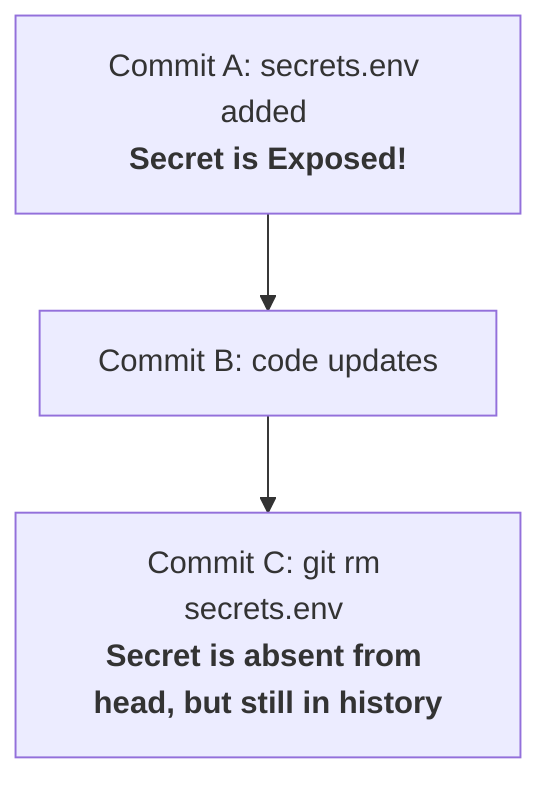
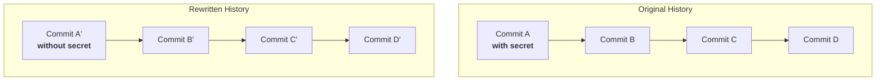
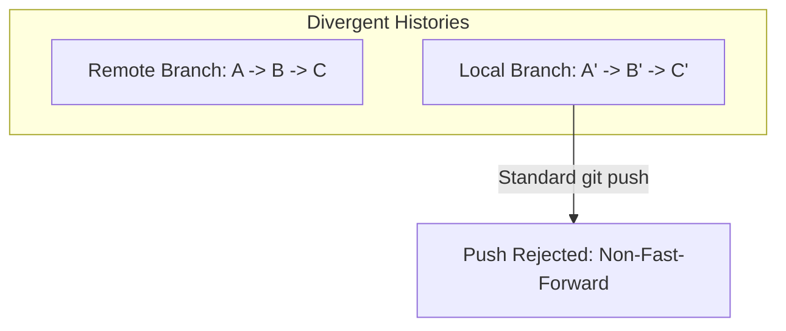
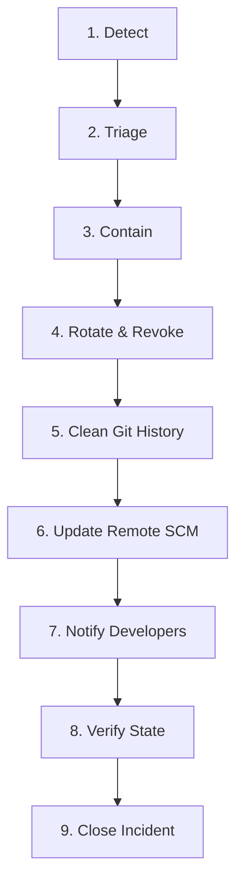

# Table of Contents

- [Objective](#objective)
- [Module 1: Fundamentals of SCM History Cleanup](#module-1-fundamentals-of-scm-history-cleanup)
  - [The Core Problem: Git History Immutability](#the-core-problem-git-history-immutability)
  - [Risk Profile of Legacy History](#risk-profile-of-legacy-history)
  - [The Golden Rule of Secret Remediation](#the-golden-rule-of-secret-remediation)
  - [History Rewriting Mechanics](#history-rewriting-mechanics)
  - [Tools Overview](#tools-overview)
- [Module 2: git-filter-repo](#module-2-git-filter-repo)
  - [Overview](#overview)
  - [Prerequisites & Mirror Clones](#prerequisites--mirror-clones)
  - [Git Repository Internals](#git-repository-internals)
  - [Repository Analysis](#repository-analysis)
  - [Execution Commands](#execution-commands)
- [Module 3: BFG Repo Cleaner](#module-3-bfg-repo-cleaner)
  - [Overview](#overview-1)
  - [BFG vs. git-filter-repo](#bfg-vs-git-filter-repo)
  - [Installation & Setup](#installation--setup)
  - [Cleanup Execution](#cleanup-execution)
  - [HEAD Protection Mechanism](#head-protection-mechanism)
  - [Post-BFG Garbage Collection](#post-bfg-garbage-collection)
- [Module 4: Force Pushing Rewritten History](#module-4-force-pushing-rewritten-history)
  - [Why Force Push is Required](#why-force-push-is-required)
  - [Fast-Forward vs. Non-Fast-Forward Pushes](#fast-forward-vs-non-fast-forward-pushes)
  - [Force Push Command Options](#force-push-command-options)
  - [Mirror Push Governance](#mirror-push-governance)
  - [Force Push Decision Matrix](#force-push-decision-matrix)
- [Module 5: Enterprise Secret Remediation Workflow](#module-5-enterprise-secret-remediation-workflow)
  - [Remediation Lifecycle](#remediation-lifecycle)
  - [Detailed Steps](#detailed-steps)
  - [Severity Classifications](#severity-classifications)
  - [DevSecOps KPIs](#devsecops-kpis)
- [Module 6: Developer Synchronization](#module-6-developer-synchronization)
  - [The Local Clone Vulnerability](#the-local-clone-vulnerability)
  - [Why Standard Pulls Fail](#why-standard-pulls-fail)
  - [Developer Synchronization Options](#developer-synchronization-options)
  - [Enterprise Communication Template](#enterprise-communication-template)
- [Module Interview Questions & Key Takeaways](#module-interview-questions--key-takeaways)
  - [Module 1 Q&A](#module-1-qa)
  - [Module 2 Q&A](#module-2-qa)
  - [Module 3 Q&A](#module-3-qa)
  - [Module 4 Q&A](#module-4-qa)
  - [Module 5 Q&A](#module-5-qa)
  - [Module 6 Q&A](#module-6-qa)

---

## Objective

Learn why secrets remain in Git history after deletion, why standard file deletion is insufficient, and how to safely rewrite repository history to permanently remove exposed credentials. Master the usage of industry-standard tools (`git-filter-repo`, BFG Repo Cleaner) and design robust synchronization workflows for development teams.

---

# Module 1: Fundamentals of SCM History Cleanup

## The Core Problem: Git History Immutability

When a developer accidentally commits a secret (e.g., an AWS Access Key) and pushes it to a remote repository, they might try to resolve the leak by running a standard file deletion:

```bash
# Deleting a file in a new commit does NOT delete its history
git rm secrets.env
git commit -m "Removed secret"
git push
```

**Question:** Is the secret gone from SCM?  
**Answer:** **No.**

Git history is designed as an immutable directed acyclic graph (DAG) of snapshots. A delete commit simply creates a new commit pointing to a state where the file is absent. The old commit containing the secret remains in the Git log and database.



---

## Risk Profile of Legacy History

Leaving secrets in past commits exposes the organization to severe risks:
* **Attacker Scanning:** Threat actors continuously scrape SCM history, branches, tags, forks, and pull request metadata for credentials.
* **Metadata Persistence:** Git backups, clones, mirrors, and forks retain the legacy commit snapshots even if the default branch is modified.
* **Compliance Failures:** Audits (SOC2, ISO27001) flag historical exposures as active vulnerabilities.

---

## The Golden Rule of Secret Remediation

Never begin SCM cleanup without securing active resources. Follow this workflow:

1. **Detect Leak:** Confirm the leaked credential type and scope.
2. **Rotate/Revoke Credential:** *First Active Step.* Deactivate the compromised key at the provider (AWS, database, etc.) and generate a new one.
3. **Update Applications:** Configure apps to use the new credentials via Secret Managers.
4. **Clean SCM History:** Purge the secret from all commits, tags, and branches.
5. **Notify Teams:** Inform developers to synchronize their local clones.
6. **Verify Resolution:** Scan the updated SCM history.
7. **Close Incident:** Archive logs and document lessons learned.

---

## History Rewriting Mechanics

To remove a secret, the Git commit graph must be rebuilt. Re-writing a historical commit changes its content, which changes its commit hash. Since commit hashes are parent-dependent, modifying one commit changes the hashes of all subsequent commits.



Every commit hash diverges ($A \neq A'$, $B \neq B'$, $C \neq C'$, $D \neq D'$), making the rewritten local branch incompatible with the remote branch.

---

## Tools Overview

* **`git-filter-repo` (Recommended):** The official, Python-based modern tool for rewriting history. Fast, flexible, and capable of complex path filtering, author renaming, and pattern replacement.
* **BFG Repo Cleaner:** A fast, Java-based alternative. Optimized for common remediation tasks like deleting files by name or replacing matching text strings.
* **`git filter-branch` (Deprecated):** The legacy built-in Git history tool. Avoid using this tool because it is slow, complex, and highly prone to corrupting repositories.

---

# Module 2: git-filter-repo

## Overview

`git-filter-repo` is the modern standard for modifying commit history. It operates directly on repository files and objects, offering a safe, fast, and highly scriptable workflow.

---

## Prerequisites & Mirror Clones

Before running `git-filter-repo`, you must work on a complete backup of the repository. Operating directly on active workspaces risks data loss.

### Mirror Clone Creation
A **Mirror Clone** is a bare repository containing all branches, tags, remote tracking data, and internal reference structures.

```bash
# Create a mirror clone
git clone --mirror https://github.com/company/payment-service.git
cd payment-service.git
```

### Normal vs. Mirror Clones

| Aspect | Normal Clone (`git clone`) | Mirror Clone (`git clone --mirror`) |
| :--- | :--- | :--- |
| **Workspace** | Checked-out files + `.git/` folder | Bare repository (no working files checked out) |
| **Branches** | Tracks the default checkout branch | Exports and tracks all branches, tags, and refs |
| **Use Case** | Day-to-day feature development | Repository administration, migration, and history rewrites |

---

## Git Repository Internals

Inside a mirror clone (or the `.git` folder of a normal clone), Git stores its core state:

* **`HEAD`:** A pointer file indicating the default branch (e.g., `ref: refs/heads/main`).
* **`config`:** The configuration file tracking bare status (`bare = true`) and remote mirrors (`mirror = true`).
* **`objects/`:** The database storing all file contents (blobs), directory structures (trees), commits, and tags as compressed objects.
* **`refs/`:** Pointers to commits, categorized into branches (`refs/heads/`), tags (`refs/tags/`), and remote branches (`refs/remotes/`).
* **`packed-refs`:** An optimized file index that compresses thousands of tags and branch refs into a single lookup table.
* **`hooks/`:** Scripts triggered by Git lifecycle events (e.g., `pre-commit`, `pre-push`).

---

## Repository Analysis

Before rewriting history, analyze the repository to identify large blobs or target file paths:

```bash
# Run repository analysis
git filter-repo --analyze
```

This command generates a report directory at `filter-repo/analysis/` containing:
* `largest-blobs.txt`: Ranks all files by size (helps locate large databases or media).
* `path-all-sizes.txt`: Ranks directory paths by total cumulative size.
* `directories-all-sizes.txt`: Identifies folders containing the most data.
* `blob-shas-and-paths.txt`: Maps Git object hashes to their actual file paths in the workspace history.

---

## Execution Commands

### 1. Remove a Target File from All Commits
To completely purge a specific file (e.g., `secrets.env`) from every branch and tag:

```bash
git filter-repo \
  --path secrets.env \
  --invert-paths
```
*Note:* The `--invert-paths` flag tells the tool to discard the specified path and keep all others.

### 2. Remove a Folder from All Commits
To remove an entire directory (e.g., `credentials/`):

```bash
git filter-repo \
  --path credentials/ \
  --invert-paths
```

### 3. Replace a Text String Everywhere
To overwrite exposed secrets with placeholders across all files in history, create a mapping file (e.g., `replacements.txt`):

```text
# replacements.txt syntax: OriginalPattern==>ReplacementText
ABC123SECRET==>***REMOVED***
my_db_password==>***REMOVED***
```

Run the rewrite command pointing to the mapping file:
```bash
git filter-repo --replace-text replacements.txt
```

---

# Module 3: BFG Repo Cleaner

## Overview

**BFG Repo Cleaner** is an alternative history rewriter. Built in Java, it is designed for simple, high-performance cleaning operations where fine-grained path renaming or author modification is not required.

---

## BFG vs. git-filter-repo

| Feature | git-filter-repo | BFG Repo Cleaner |
| :--- | :--- | :--- |
| **Git Recommendation** | Yes (official recommendation) | No (third-party alternative) |
| **Engine Requirements** | Python | Java (JVM) |
| **Flexibility** | Extremely high (complex filters) | Low (pre-defined tasks) |
| **Speed** | Fast | Very Fast |
| **HEAD Protection** | No (modifies HEAD directly) | Yes (protects HEAD by default) |

---

## Installation & Setup

Verify Java runtime is installed:
```bash
java -version
```

Download the BFG JAR file:
```bash
wget https://repo1.maven.org/maven2/com/madgag/bfg/1.15.0/bfg-1.15.0.jar
```

---

## Cleanup Execution

Operating on a mirror clone of the repository:

### 1. Delete a File by Name
```bash
java -jar bfg-1.15.0.jar --delete-files secrets.env payment-service.git
```

### 2. Delete a Folder by Name
```bash
java -jar bfg-1.15.0.jar --delete-folders credentials payment-service.git
```

### 3. Replace a Secret Pattern
Create `replacements.txt` containing the values to swap:
```text
AWS_SECRET==>***REMOVED***
```

Run BFG text replacement:
```bash
java -jar bfg-1.15.0.jar --replace-text replacements.txt payment-service.git
```

---

## HEAD Protection Mechanism

By default, BFG **does not modify the HEAD commit** (the latest commit of your default branch). This safety guard prevents BFG from deleting active code files.
* **Remediation Requirement:** If a secret is present in the latest commit, you must modify the file in a new commit to remove the secret *before* running BFG. BFG will then scrub the secret from all preceding commits.

---

## Post-BFG Garbage Collection

Running BFG leaves detached commits and unlinked objects inside the Git database. To shrink the repository database and permanently delete these orphaned objects, you must execute a garbage collection cycle:

```bash
# Expire local reflogs to break references to old commits
git reflog expire --expire=now --all

# Prune and rebuild the Git database aggressively
git gc --prune=now --aggressive
```

---

# Module 4: Force Pushing Rewritten History

## Why Force Push is Required

After running `git-filter-repo` or BFG, the commit graph changes. Commit hashes on the administration machine no longer align with the remote SCM hashes. Because the remote repository contains the old history, standard fast-forward pushes will be rejected by the SCM host.

---

## Fast-Forward vs. Non-Fast-Forward Pushes

* **Fast-Forward Push:** The remote branch history is a direct prefix of the incoming local branch history. Git simply moves the remote HEAD pointer forward. This is the standard, safe push model.
* **Non-Fast-Forward Push:** The incoming branch history diverges from the remote branch. The remote repository has commits that do not exist locally, or hashes have changed. Git blocks this to prevent overwriting active SCM commits.



---

## Force Push Command Options

To overwrite the remote SCM history with the rewritten history, a force push is required:

### 1. Dangerous Force Push (`--force` / `-f`)
```bash
git push --force origin main
```
* **Behavior:** Tells the SCM server to overwrite its current branch with the local branch, ignoring any updates pushed by other developers.
* > [!WARNING]
  > **Data Loss Risk:** If another developer pushed changes to the remote branch while you were running the history rewrite, their changes will be lost.

### 2. Safer Force Push (`--force-with-lease`)
```bash
git push --force-with-lease origin main
```
* **Behavior:** Verifies that the remote SCM branch ref matches the local tracking ref (meaning no new commits have been pushed to origin). If the remote branch has changed, the push is safely rejected.

---

## Mirror Push Governance

After executing a history cleanup on a mirror clone, you must push all updated branches and tags to clear the remote SCM completely.

Use explicit commands to ensure coverage:
```bash
# Force push all rewritten branches
git push --force --all origin

# Force push all rewritten tags
git push --force --tags origin
```

---

## Force Push Decision Matrix

| Scenario | Recommended Command | Rationale |
| :--- | :--- | :--- |
| **Normal Commit Updates** | `git push` | Standard development; no history modifications. |
| **Rebased Feature Branch** | `git push --force-with-lease` | Safely updates individual branches during rebase. |
| **Secret Cleanups (Branches)** | `git push --force --all` | Required to force update all branches across the SCM. |
| **Secret Cleanups (Tags)** | `git push --force --tags` | Required to overwrite tag commits containing historical secrets. |

---

# Module 5: Enterprise Secret Remediation Workflow

## Remediation Lifecycle



---

## Detailed Steps

### Step 1: Detect
Identify the leak via automated scanners (GitGuardian, Gitleaks, SCM notifications) or internal audits.

### Step 2: Triage
Understand the impact:
* What type of key leaked?
* Is it active?
* What resources are at risk (Production, Staging, Dev)?
* Is the repository public?

### Step 3: Contain
Prevent further data exposure. Temporarily disable pipelines, block SCM access if the repo is public, and restrict token scopes immediately.

### Step 4: Rotate/Revoke
Generate a new credential, deploy it to configurations/Vault, and delete the compromised token at the provider.

### Step 5: Clean Git History
Run `git-filter-repo` or BFG to scrub the token and its associated files from the commit history.

### Step 6: Update Remote SCM
Force push all branches and tags back to the central repository.

### Step 7: Notify Developers
Inform the engineering team of the history rewrite and instruct them to resynchronize their workstations.

### Step 8: Verify State
Run a post-remediation scan (Gitleaks, active checking) to confirm the secret is inactive and absent from history.

### Step 9: Close Incident
Document the root cause, remediation steps, MTTR, and preventative measures in an incident post-mortem.

---

## Severity Classifications

| Severity | Definition | Target SLA | Examples |
| :--- | :--- | :--- | :--- |
| **Critical** | Credentials with administrative access or production database access. | **2 Hours** | AWS Root Keys, production DB passwords, stripe live keys. |
| **High** | Write-level access to staging or internal tooling. | **8 Hours** | GitHub PAT with repo scope, corporate Slack bot tokens. |
| **Medium** | Read-only access to development or test environments. | **24 Hours** | Dev API keys, QA database passwords. |
| **Low** | Expired, invalid, or mock credentials. | **72 Hours** | Test endpoints, stale keys, local development mocks. |

---

## DevSecOps KPIs

Organizations measure SCM security using KPIs:
* **MTTR (Mean Time to Remediate):** Time elapsed between detection and credential rotation.
* **Escape Rate:** Percentage of secrets that bypass pre-commit hooks and must be cleaned from the remote SCM.
* **Open Critical Leaks:** Number of active, unresolved production-level incidents.

---

# Module 6: Developer Synchronization

## The Local Clone Vulnerability

Cleaning history on GitHub or GitLab only updates the server. It does not modify local clones on developer laptops.

```text
[SCM Server] ── History Cleaned ──> Commit Hashing updated (A' -> B' -> C')
[Developer Laptop] ── Stale Clone ──> Retains old history and active secrets (A -> B -> C)
```

> [!IMPORTANT]
> **The Local Risk**
> If developers continue working on their local stale clones, their subsequent branch pushes can push the old history back to the SCM server, re-introducing the secret.

---

## Why Standard Pulls Fail

Running `git pull` on a stale clone after a history rewrite will cause Git to attempt a merge between the new commit chain ($A' \to B'$) and the old commit chain ($A \to B$). This leads to merge conflicts, duplicate commit histories, and pushes the secret back to the remote repository.

---

## Developer Synchronization Options

Developers must select one of the following methods to align with the rewritten remote history:

### Option 1: Complete Re-clone (Safest & Recommended)
Delete the stale local directory and clone the repository fresh from origin. This ensures no legacy commits are retained.

```bash
# Delete the stale repository
rm -rf payment-service

# Clone fresh from SCM origin
git clone https://github.com/company/payment-service.git
```

### Option 2: Hard Reset (Fastest)
Fetch the new history from origin and point the local branch HEAD to the new remote reference.
* *Warning:* This will discard any uncommitted local modifications.

```bash
# Fetch latest references
git fetch origin

# Align local head to rewritten remote branch
git reset --hard origin/main
```

### Option 3: Stash and Re-align
If you have uncommitted changes, save them to the stash stack before resetting history:

```bash
# Stash active changes
git stash

# Fetch and align local branch
git fetch origin
git reset --hard origin/main

# Re-apply stashed work on top of new history
git stash pop
```

---

## Enterprise Communication Template

Security teams must send a clear notification immediately after force pushing rewritten history:

```text
Subject: IMMEDIATE ACTION REQUIRED - Repository History Cleaned: [payment-service]

Hello Engineering Team,

To secure exposed credentials, the commit history of the [payment-service] repository has been rewritten. 

As a result, all remote commit hashes have changed. To prevent re-introducing compromised commits, please follow these synchronization steps immediately:

1. Stash or backup any uncommitted local work.
2. Delete your old local repository folder:
   rm -rf payment-service
3. Clone the repository fresh:
   git clone https://github.com/company/payment-service.git
4. Do not run 'git pull' or push branches based on the old commit history.

Thank you for your cooperation in maintaining SCM security.

DevSecOps Team
```

---

# Module Interview Questions & Key Takeaways

## Module 1 Q&A

### Q: Why is running `git rm` on a secret file insufficient?
**A:** `git rm` only removes the file from the current and future commits. The secret remains stored in the immutable historical commits, which can be extracted from SCM history.

### Q: What is the first remediation step after a secret leak?
**A:** Immediately rotate and revoke the credential at the provider. History cleanup should follow rotation, as rotation invalidates the compromised key instantly.

---

## Module 2 Q&A

### Q: What is a mirror clone, and why is it used for history cleaning?
**A:** A mirror clone is a bare repository that contains a complete copy of all branches, tags, and SCM metadata. Working on a mirror clone ensures that the history rewrite applies to all references.

### Q: How do you identify large files or paths before running git-filter-repo?
**A:** Run `git filter-repo --analyze` to examine the repository. This generates size, path, and file type reports in the `filter-repo/analysis/` folder.

---

## Module 3 Q&A

### Q: How does BFG Repo Cleaner protect the HEAD commit?
**A:** BFG protects the latest commit (HEAD) by default to prevent developers from accidentally deleting files in active use. You must commit a clean version of the code before running BFG.

### Q: Why must you run garbage collection after running BFG?
**A:** BFG decouples old commits from SCM branches but does not delete the physical objects from the repository database. Running `git gc --prune=now --aggressive` permanently deletes these orphaned objects.

---

## Module 4 Q&A

### Q: Why is `git push --force` discouraged in team environments?
**A:** It blindly overwrites remote references, potentially deleting work pushed by other developers. `--force-with-lease` is safer as it checks if the remote branch has changed before pushing.

### Q: Why is force pushing tags necessary during secret remediation?
**A:** Tags are static pointers to commits. If a tag points to a commit containing a secret, that commit remains accessible in the repository. Pushing updated tags overwrites these pointers.

---

## Module 5 Q&A

### Q: What are the phases of the Secret Remediation Lifecycle?
**A:** The phases are: Detect, Triage, Contain, Rotate/Revoke, Clean Git History, Update Remote SCM, Notify Developers, Verify State, and Close Incident.

### Q: What is MTTR in SCM security?
**A:** Mean Time to Remediate is the average time elapsed between when a secret leak is detected and when the credential is successfully rotated.

---

## Module 6 Q&A

### Q: What occurs if a developer runs `git pull` after history is rewritten?
**A:** Git will try to merge the new remote history with the old local history, leading to duplicate commits, merge conflicts, and re-introducing the secret back to the remote server.

### Q: What is the safest way for developers to sync their workspaces after a rewrite?
**A:** The safest method is to delete the local stale clone and clone the repository fresh from origin.

---

## Key Takeaways

* **Git History is Forever:** Standard deletions do not secure historical commits; SCM history must be rewritten.
* **Rotation is Priority #1:** Credential rotation cuts off access instantly; history cleanup is a secondary containment measure.
* **Use Modern Tooling:** Use `git-filter-repo` for reliable and fast history rewrites.
* **Clean the Database:** Run reflog expiration and aggressive garbage collection to purge deleted objects.
* **Govern the Push:** Use `--force-with-lease` to push changes safely, and update branches and tags completely.
* **Notify and Re-sync:** Server cleanup is ineffective if developers push old commits back. Enforce re-cloning to ensure complete cleanup.
